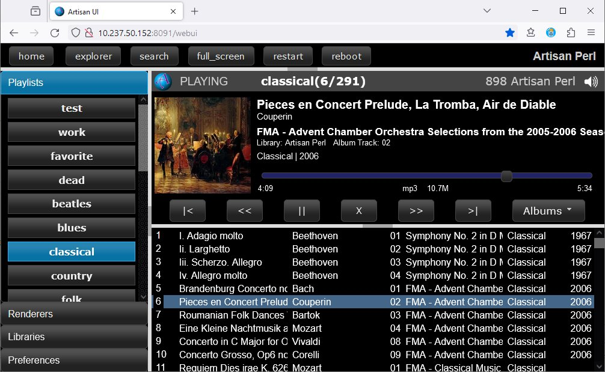

# Artisan Perl

Artisan Perl is a complete, self contained, system for organizing,
presenting, and playing audio from a local Music Library consisting of
files, like MP3s, contained in a folder tree on some machine.

Artisan implements, and takes advantage of industry standards, like
UPNP and DLNA to work with other devices on the home network.

- it is a standard DLNA Media Server, providing its Library to a huge
  number of existing devices (Music Players) that can render audio on
  a home network.
- it can present and play audio from a similarly huge number of
  existing networked Media Servers that implement the DLNA standard.

Artisan Perl runs as a Service on a Windows or Linux Machine, and
provides a User Interface via an HTTP Server that can be accessed
by a Browser anywhere on the on home network.  From that User
Interface you can play and control music on either the Server
machine, or on the device that is running the Browser.

The responsive User Interface is designed to work with any Browser,
on a variety of different devices and screen sizes, from desktop or
laptop computers, as shown above, to smaller touch devices like
tablets and phones.

Artisan can work with MP3, WMA, and M4A audio files. However,
since Web Browsers do not typically support the WMA standard, and
for other reasonse, in my own usage, I have decided to standardize
all of my own personal music as MP3 files.

## Renderers, Libraries, and SSDP

The two most impoortant concepts in Artisan are **Renderers**
and **Libraries**.

A *Renderer* is a device that can **play** music.  Artisan
supports two Renderers.  Whether running on Linux (typically
a Raspberry Pi) or on a Windows machine, the primary Renderer
is the machine on which the Artisan service is running.
In other words Artisan can play music on your Windows machine
or Raspberry Pi through any of their normal audio devices.

The second Renderer supported directly by Artisan is the device
on which the Browser is running.  So, for example, you can
play music from Artisan on your cellphone or tablet, or any
other device on your home network that has a Browser that
supports HTML audio.

A *Library* is a synonym for a *DLNA Media Server*, an industry
standard for devices that contain and/or can **serve** music files
to be played by a Renderer. Artisan itself is generally the primary
Library you will use, containing your audio files, organized how
you like them, on the machine running the service.

Artisan can also play music from any other Libraries (*DLNA
Media Servers*) that exist on your home network.  Some examples
of standard DLNA Media Servers include the **Windows Media Player**
and program like **Plex**.  And, once again, any standard *DLNA Media
Renderer*, which includes programs like the Windows Media Player,
or devices like Samsung Smart TV's, can access the Artisan Library
and play music from it.

Because Artisan fully supports **SSDP** (Simple Search and Discovery
Protocol), it automatically locates, and is located by, these other
devices on your home network without the need for any complicated
configuration.  As soon as Artisan is running, it will show up in
WMP (Windows Media Player) as an available library, and vice-versa,
the WMP Library will show up in the Artisan Web UI.

Artisan Perl

- is a DLNA MediaServer
- can access any existing DLNA MediaServers

It is **not** a DLNA Renderer.  Artisan itself cannot be
controlled by existing DLNA Control Points.  Internally
it abstracts the existing DLNA Media Servers **and Renderers**
it finds on the home network down to a much simpler API
for use by the webUI.

## Standardization on MP3 files

As of today, 2023-12-10, I have decided to standardize my Library
to MP3 files, and will use ffmpeg_prebuilt_6.1.exe to convert
all of my WMA and M4A files to MP3's at 124kps using the command
line:

	ffmpeg_prebuilt_6.1.exe -i blah.m4a -acodec libmp3lame blah.mp3

and to cleanup the database, removing all unused fpcalc_info files.
To begin with, I added ffmpeg_prebuilt_6.1.exe from

	/zip/apps/ffmpeg/ffmpeg-6.1-essentials_build.z7 ffmpeg.exe

to the /bin folder. Then I made a copy of /mp3s to /mp3s_save (there is
already a vestigial copy in /junk/maybe_save) and wrote and tested
a script /docs/tests/convertAllToMP3.pm that does the conversions,
removing the old files in the process.

This is specifically to solve the fact that HTML Renderers cannot
play WMA files, but will eventually lead to other simplifications
in the code by eliminating other Media File Types.

## Design Details

In reference to previous Artisan Perl and
currently un-modified Artisan Android.

**Playlists are 'persistent' per Library**

- The system able to play through a sorted-random-by-album playlist
  on multiple different devices sequentially so that I don't hear the
  same albums/song twice and yet I hear all of them once.
- I can select anything from the explorer tree and
  play it immediately (interrupting the current playlist).

**Got rid of 'Playlist Sources'**

Playlists are bound to libraries for compatibility with WMP and
a more general UI.

- added a new 'dirtype' = 'playlist'
- redesigned playlists.db and namedb.files (they are now incompatible
  with Artisan Android).

I *think* the main artisan.db file remains compatible.

**Webui HTML Renderer**

The webUI has a truly Local Renderer in the embeded HTML music player
that can play music on the Browsing, as opposed to the Serving, device.

Artisan Android does not currently serve the webUI.  It should.

**WebUI FancyTree now entirely JSON based**

I no longer send HTML from the Server to the webUI.

The understanding starts by realizing that if the 'source:' or 'lazyLoad:' options
of the tree return Hashes, those hashes are used to form Ajax requests
to get the data, which is then loaded into the tree from the 'success'
of the Ajax call.  BUT, if source: or lazyLoad: return Arrays, those
arrays ARE the data.   See explorer.js for more info.

## License

This program is free software: you can redistribute it and/or modify
it under the terms of the GNU General Public License Version 3 as published by
the Free Software Foundation.

This program is distributed in the hope that it will be useful,
but WITHOUT ANY WARRANTY; without even the implied warranty of
MERCHANTABILITY or FITNESS FOR A PARTICULAR PURPOSE.  See the
GNU General Public License for more details.

Please see **LICENSE.TXT** for more information.

---- end of readme.md ----
